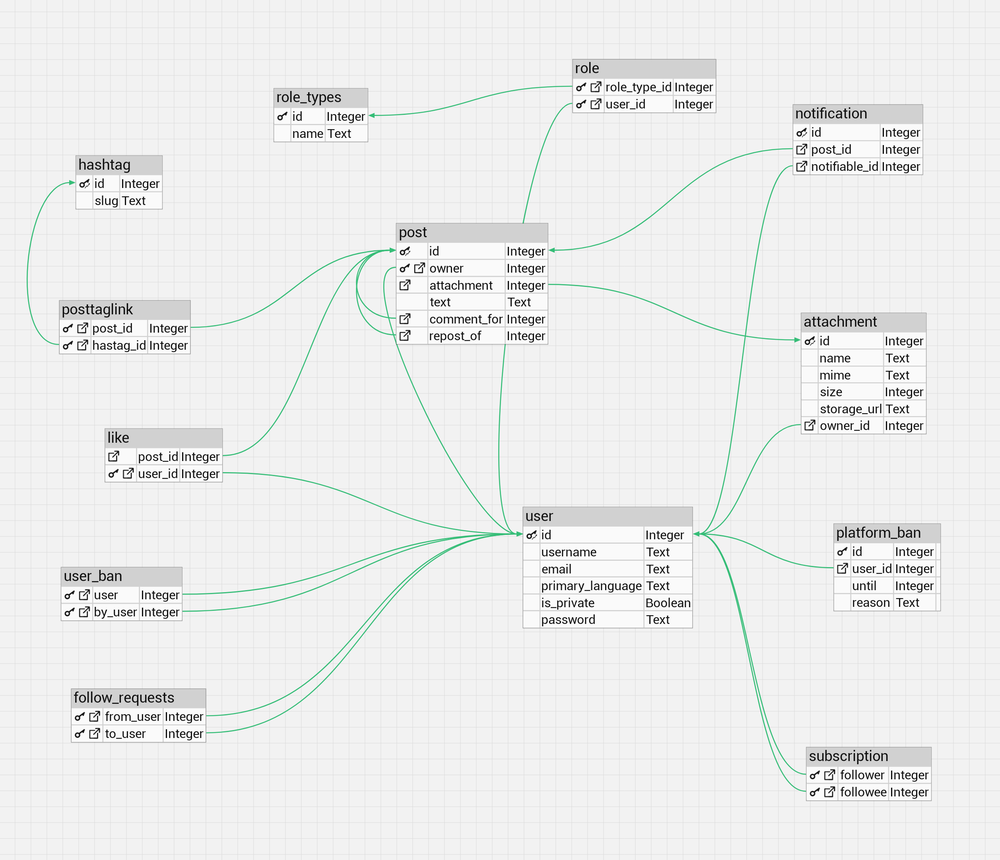

# НИЯУ МИФИ. ИИКС. Лабораторная работа №1. Мищенко Тимофей, Б20-505. 2022.

## Обзор предметной области

Рассматриваемая предметная область - социальная сеть, схожая с Twitter. Имеется сущность **пользователь**, отношение **подписанности** между пользователями. Сущность **поста**. У поста может быть **аттачмент** в виде медиафайла и его характеристики. Пост может быть **репостом**. Пост может содержать, а может не содержать сущность **хештег**. Должна быть возможность искать все посты по хештегу. Пользователь может быть **приватным**, появляется сущность **запрос на подписку**. Пользователь может быть **заблокированным** для другого пользователя. Пост может быть **комментарием** (но все еще является постом). Пользователь может поставить **лайк** на пост. Пользователь может быть подписан на **уведомления** о постах другого пользователя. Пользователь характеризуется набором **ролей**: verified, republican, shadowbanned, moderator, elon_musk. Пользователь может быть **заблокирован** на определенное время или навсегда.  

## Спецификация таблиц

### user

| Название Поля | Тип | Описание | Первичный ключ? | Внешний ключ? |
| --- | --- | --- | --- | --- |
| id | int | Идентификатор | да | нет |
| username | text | Имя пользователя | нет | нет |
| password | text | Хешированный пароль | нет | нет |
| email | text | Электронная почта | нет | нет |
| is_private | bool | Приватный ли пользователь | нет | нет |

### post

| Название Поля | Тип | Описание | Первичный ключ? | Внешний ключ? |
| --- | --- | --- | --- | --- |
| id | int | Идентификатор | да | нет |
| owner_id | int | Идентификатор пользователя, создавшего пост | нет | user.id |
| text | text | Текст поста | нет | нет |
| comment_for | int | Идентификатор поста, на который оставлен комментарий | нет | post.id |
| repost_of | int | Идентификатор поста, который был репостнут | нет | post.id |
| attachment_id | text | Идентификатор медиафайла (nullable) | нет | attachment.id |

### hashtag

| Название Поля | Тип | Описание | Первичный ключ? | Внешний ключ? |
| --- | --- | --- | --- | --- |
| id | int | Идентификатор | да | нет |
| slug | text | Хештег | нет | нет |

### posttaglink

| Название Поля | Тип | Описание | Первичный ключ? | Внешний ключ? |
| --- | --- | --- | --- | --- |
| post_id | int | Идентификатор поста | да | post.id |
| hashtag_id | int | Идентификатор хештега | да | hashtag.id |

### attachment

| Название Поля | Тип | Описание | Первичный ключ? | Внешний ключ? |
| --- | --- | --- | --- | --- |
| id | int | Идентификатор | да | нет |
| name | text | Название файла | нет | нет |
| mime | text | MIME-тип файла | нет | нет |
| size | int | Размер файла | нет | нет |
| storage_url | text | URL файла | нет | нет |
| owner_id | int | Идентификатор пользователя, создавшего пост | нет | user.id |

### subscription

| Название Поля | Тип | Описание | Первичный ключ? | Внешний ключ? |
| --- | --- | --- | --- | --- |
| follower_id | int | Идентификатор подписчика | да | user.id |
| followee_id | int | Идентификатор подписки | да | user.id |

### subscription_request

| Название Поля | Тип | Описание | Первичный ключ? | Внешний ключ? |
| --- | --- | --- | --- | --- |
| follower_id | int | Идентификатор подписчика | да | user.id |
| followee_id | int | Идентификатор подписки | да | user.id |

### platform_ban

| Название Поля | Тип | Описание | Первичный ключ? | Внешний ключ? |
| --- | --- | --- | --- | --- |
| id | int | Идентификатор | да | нет |
| user_id | int | Идентификатор пользователя | да | user.id |
| until | int | Дата окончания блокировки, UTC timestamp | нет | нет |
| reason | text | Причина блокировки | нет | нет |

### user_ban

| Название Поля | Тип | Описание | Первичный ключ? | Внешний ключ? |
| --- | --- | --- | --- | --- |
| user | int | Идентификатор | да | нет |
| by_user | int | Идентификатор пользователя | да | user.id |

### role_types

| Название Поля | Тип | Описание | Первичный ключ? | Внешний ключ? |
| --- | --- | --- | --- | --- |
| id | int | Идентификатор | да | нет |
| name | text | Название роли | нет | нет |

### role

| Название Поля | Тип | Описание | Первичный ключ? | Внешний ключ? |
| --- | --- | --- | --- | --- |
| user_id | int | Идентификатор пользователя | да | user.id |
| role_id | int | Идентификатор роли | да | role_types.id |

### notification

| Название Поля | Тип | Описание | Первичный ключ? | Внешний ключ? |
| --- | --- | --- | --- | --- |
| id | int | Идентификатор | да | нет |
| post_id | int | Идентификатор поста | нет | post.id |
| notifiable_id | int | Идентификатор пользователя | нет | user.id |

### like

| Название Поля | Тип | Описание | Первичный ключ? | Внешний ключ? |
| --- | --- | --- | --- | --- |
| user_id | int | Идентификатор пользователя | да | user.id |
| post_id | int | Идентификатор поста | да | post.id |

## Диаграмма сущностей

## Доказательство 3 нормальной формы

Не очень формальные требования для 3НФ:

1) Порядок строк не несет в себе информации (вроде очевидно)
2) У столбца определенный тип данных и только он (СУБД не позволит сделать иначе)
3) Есть первичный ключ (есть везде, где-то составной)
4) Повторяющиеся группы не разрешены - нужно доказывать.
5) Каждый столбец зависит только от первичного ключа - нужно доказывать
6) Каждый столбец зависит только от первичного ключа, полного первичного ключа и только от него - нужно доказывать.

Пропустим таблицы состоящие только из первичных ключей - по сути отношения many-to-many где сложно нарушить 3НФ. Это таблицы `posttaglink`, `subscription`, `role`, `like`, `user_ban`, `follow_requests`. Также не интересны таблицы `role_types` `hashtag` - имеем лишь первичный ключ в виде `id` и соответствующее ему значение - единственная причина для этого это то что я не люблю использовать строки как первичные ключи. По сути в них нет никакого отношения. Чуть сложнее с `notification` - это объединение предыдущих случаев, таблица-отношение с `id`, потому что кажется что он нужен. Остаются таблицы `user`, `post`, `attachemnt`, `platform_ban`.

Каждый столбец таблицы `user` зависит только от первичного ключа, полного первичного ключа и только от него - очевидно что `username`, `email`, `primary_language`, `is_private` и password зависят только от определенного пользователя, идентифицируемого по его `id`.

У таблицы `post` первичный ключ составной - `id` постов идут с 0 (или 1 в зависимости от реализации логики) и имеют смысл только в связке с `owner`. Все аттрибуты - айди аттачмента, текст, статус комментария для другого поста или репост другого поста - зависят только от полного первичного ключа полностью, так как пост целиком характеризуется связкой из `id`+`owner`.

Строки таблицы `attachment` характеризуют опциональный медиафайл в посте (поэтому поле `attachment` в таблице `post` nullable). Все атрибуты описывают единый файл (название, размер, mime-тип, размер, ссылка на файловое хранилище) и зависят от `id`. `owner_id` также полностью зависит от файла о котором идет речь и не может зависеть от связки полей (`id` + `name` не имеет смысла).

Таблица `platform_ban` запоминает связку `user_id` + `until` + `reason`. Идентификатор связан с определенным баном, характеризующимся этими тремя параметрами. Возможно, в этой таблице требуется чуть более чуткая логика, однако она должна быть реализована не на уровне данных, а на уровне бизнес-логики.

## Приложение
[SQL сценарий для создания таблиц](./db_init.sql)

## Заключение
Была смоделирована структура базы данных для социальной сети Tw2tter. Были описаны сущности, их атрибуты и связи между ними. Была построена диаграмма сущностей. Было доказано, что база данных находится в третьей нормальной форме. 